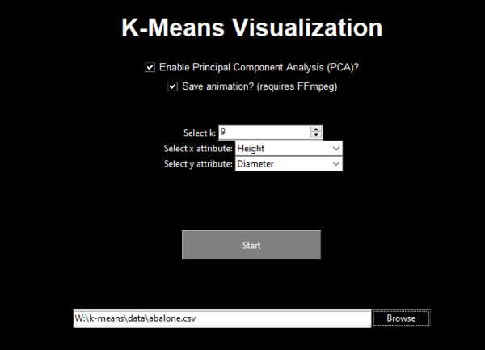
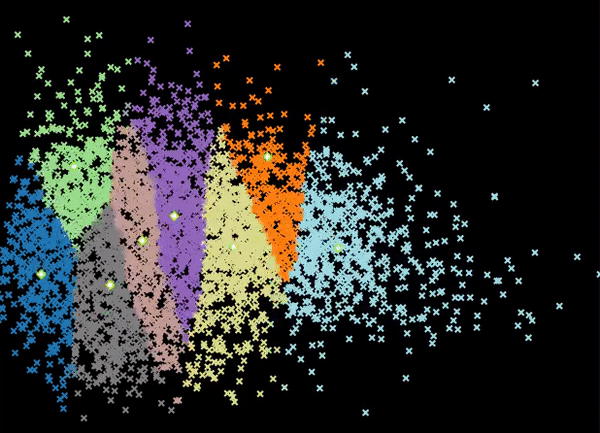

# Implementation and visualization of k-means clustering
Implemented as a form of the expectation-maximization algorithm using ``numpy``, and visualized with ``matplotlib``'s ``FuncAnimation``. A ``tkinter`` GUI allows the option to select a dataset, choose attributes to plot, choose the number of clusters and whether to apply PCA to the data.

Only the two selected attributes are used when running the program normally. Non-numerical dataset attributes and rows with missing values are excluded automatically. When PCA is selected, it overrides the chosen attributes and will instead perform PCA on the entire dataset, and use the first 2 principal components.

The abalone dataset is provided by the <a href="https://archive.ics.uci.edu/ml/datasets/abalone" >UCI Machine Learning repository</a>, and the ``cancel.jpg`` icon was sourced from <a href="https://www.flaticon.com/free-icons/close" title="close icons">Flaticon</a>.
